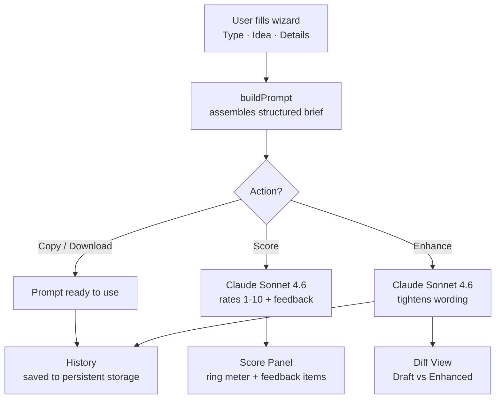
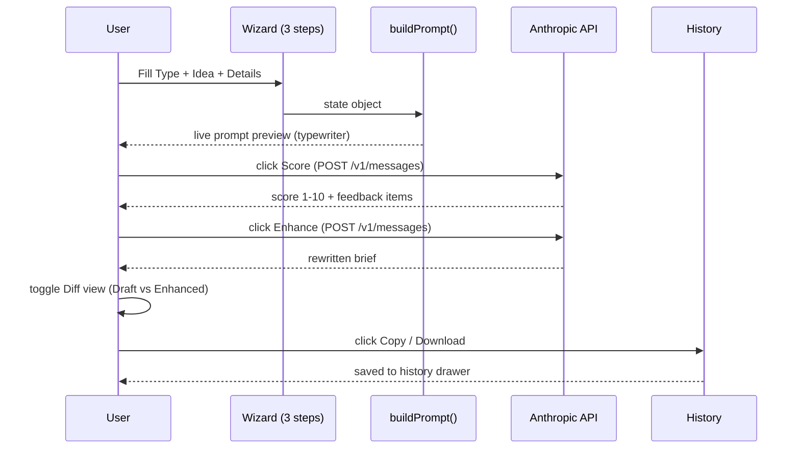

<div align="center">

```
██████╗ ██████╗  ██████╗ ███╗   ███╗██████╗ ████████╗
██╔══██╗██╔══██╗██╔═══██╗████╗ ████║██╔══██╗╚══██╔══╝
██████╔╝██████╔╝██║   ██║██╔████╔██║██████╔╝   ██║   
██╔═══╝ ██╔══██╗██║   ██║██║╚██╔╝██║██╔═══╝    ██║   
██║     ██║  ██║╚██████╔╝██║ ╚═╝ ██║██║        ██║   
╚═╝     ╚═╝  ╚═╝ ╚═════╝ ╚═╝     ╚═╝╚═╝        ╚═╝   
███████╗ ██████╗ ██████╗  ██████╗ ███████╗            
██╔════╝██╔═══██╗██╔══██╗██╔════╝ ██╔════╝            
█████╗  ██║   ██║██████╔╝██║  ███╗█████╗              
██╔══╝  ██║   ██║██╔══██╗██║   ██║██╔══╝              
██║     ╚██████╔╝██║  ██║╚██████╔╝███████╗            
╚═╝      ╚═════╝ ╚═╝  ╚═╝ ╚═════╝ ╚══════╝            
```

**Describe once. Build faster.**


[](https://arnavpatil-09.github.io/PromptForge)

*Built by [Arnav Patil](https://github.com/ArnavPatil-09) — B.Tech Computer Engineering, Pillai College*

</div>

---

## 🔥 The Problem

Developers waste tokens before writing a single line of code.

You describe your idea vaguely → the AI asks what stack you want → you clarify → it asks about features → you clarify again → it asks about constraints. You've burned 3 back-and-forths and half your context window on setup, not building.

**PromptForge fixes this.** You fill a structured wizard once — project type, idea, stack, features, constraints, output format — and it assembles a brief that any AI coding assistant can act on immediately, first try.

---

## ✨ What It Does

PromptForge is a **single-file prompt engineering tool** — no backend, no build step, no dependencies.

1. **Picks your project type** — Website, Mobile App, Backend/API, AI/ML, Browser Extension, Game, or Custom
2. **Structures your idea** — forces you to be specific about what you're building and who it's for
3. **Assembles a brief** — Role + Idea + Features + Stack + Constraints + Output format, in an order AI assistants respond best to
4. **Scores your prompt** — Claude rates it 1–10 with specific feedback ("tech stack missing", "add constraints") before you use it
5. **Enhances on demand** — Claude tightens the wording while preserving your structure
6. **Shows you the diff** — Draft vs Enhanced side by side so you see exactly what changed
7. **Saves your history** — last 30 prompts persisted across sessions, one-click reload

One form fill. One structured brief. Zero wasted back-and-forths.

---

## 🏗️ Architecture



### Three golden rules

- The **AI never sees your key** — it stays in a JS variable, cleared on refresh, never logged or sent anywhere except directly to Anthropic.
- The **template is never the output** — templates pre-fill the form, not the prompt. You always review before copying.
- The **prompt structure is fixed** — Role → Idea → Users → Features → Stack → Constraints → Format. This order is intentional; it matches how LLMs process context.

---

## 🔄 Request Flow



---

## 🧰 Tech Stack

| Layer | Choice | Why |
|---|---|---|
| Language | Vanilla JS (ES2020) | Zero build step — open `index.html` and it works |
| Styling | Pure CSS + CSS variables | No framework overhead for a single file |
| Fonts | IBM Plex Mono · Big Shoulders Display · Inter | Industrial forge aesthetic via Google Fonts CDN |
| AI | Anthropic Messages API (`claude-sonnet-4-6`) | Score + Enhance features |
| Storage | Artifact persistent storage API | Prompt history + autosave across sessions |
| Hosting | GitHub Pages | Free, instant, no CI/CD pipeline needed |

---

## ⚡ Features

| Feature | Details |
|---|---|
| 7 project types | Website, Mobile App, Backend/API, AI/ML, Browser Extension, Game, Custom |
| 14 templates | Pre-built briefs across 6 categories — one click fills the whole form |
| Live preview | Prompt updates as you type with typewriter animation |
| Forge Score | AI rates prompt 1–10 with ✅ / ⚠️ / ❌ feedback items |
| Enhance | Claude rewrites your brief while keeping your structure |
| Diff view | Draft vs Enhanced side by side |
| Prompt history | Last 30 prompts, persisted across sessions |
| Keyboard shortcuts | `Ctrl+Enter` next step · `Ctrl+Shift+C` copy · `Ctrl+T` templates · `?` shortcuts |
| Mobile responsive | Works on phone — single column, scaled hero, stacked buttons |
| Autosave | Form state restored on reload |
| API key modal | Paste once per session — never stored |

---

## 📁 Project Structure

```
promptforge/
├── index.html      ← entire app — HTML + CSS + JS in one file (~84KB)
├── README.md       ← this file
└── .gitignore
```

---

## 🚀 Running Locally

```bash
git clone https://github.com/ArnavPatil-09/promptforge.git
cd promptforge

# No npm, no build, no install — just open it
open index.html          # macOS
start index.html         # Windows
xdg-open index.html      # Linux
```

### Enabling "Score" and "Enhance"

1. Get a free API key at [console.anthropic.com](https://console.anthropic.com) — new accounts get free credits
2. Click **API Key** in the top-right of the app
3. Paste your key — it lives in memory only, cleared on refresh

> Each Score or Enhance call uses roughly 300–800 tokens.

---

## 📦 Deploying to GitHub Pages

```bash
git init
git add .
git commit -m "feat: initial release"
git branch -M main
git remote add origin https://github.com/ArnavPatil-09/promptforge.git
git push -u origin main

# Then: repo Settings → Pages → main branch → / (root) → Save
# Live in ~60 seconds at https://arnavpatil-09.github.io/PromptForge
```

**Every update after that:**
```bash
git add index.html
git commit -m "feat: what changed"
git push
```

---

## 📋 Commit History

| Hash | Message | What shipped |
|---|---|---|
| `d44db0d` | feat: PromptForge v1.0 initial release | First working build |
| `d45edeb` | cleanup: remove duplicate double-extension files | Windows rename fix |
| `62b2f98` | feat: cinematic hero, wizard steps, typewriter animation | v2.0 full redesign |
| next | feat: templates library, keyboard shortcuts, mobile responsive | v2.1 |
| next | feat: forge score, diff view | v2.2 |

---

## 🗺️ Roadmap

- [ ] Dark / Light mode toggle
- [ ] Multi-language prompt output (Hindi / Hinglish)
- [ ] Share via URL — encode prompt state in URL params
- [ ] Export to Notion
- [ ] Prompt versioning — compare edits over time

---

## 📄 License

MIT — use it, fork it, build on it.

---

<div align="center">

*See [DEVLOG.md](./DEVLOG.md) for the full build history — every decision, every bug, every commit explained.*

</div>
